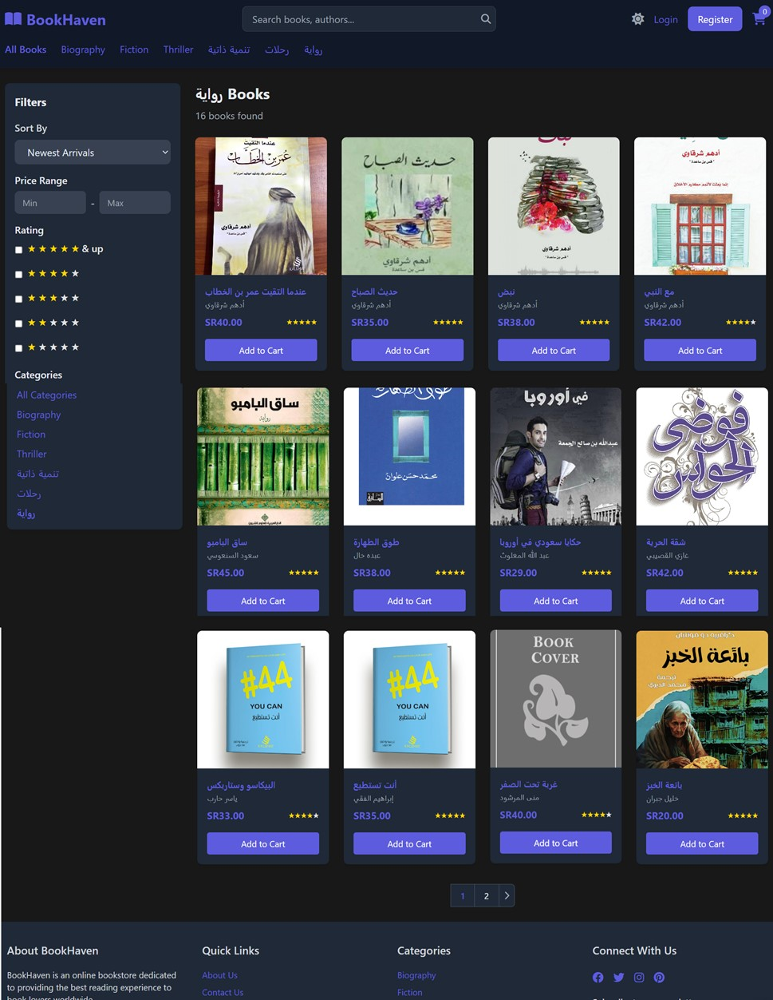
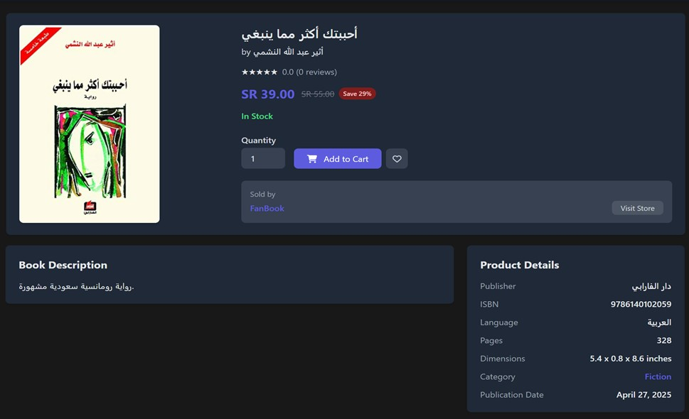
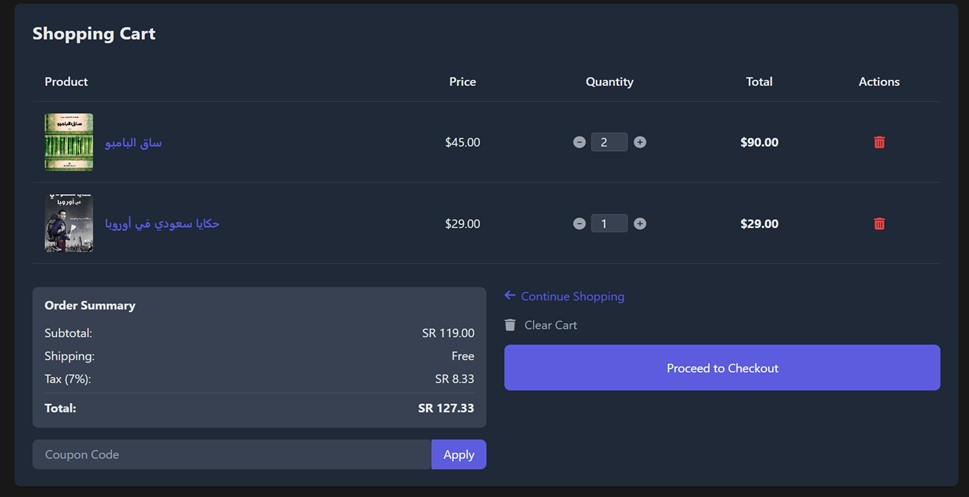
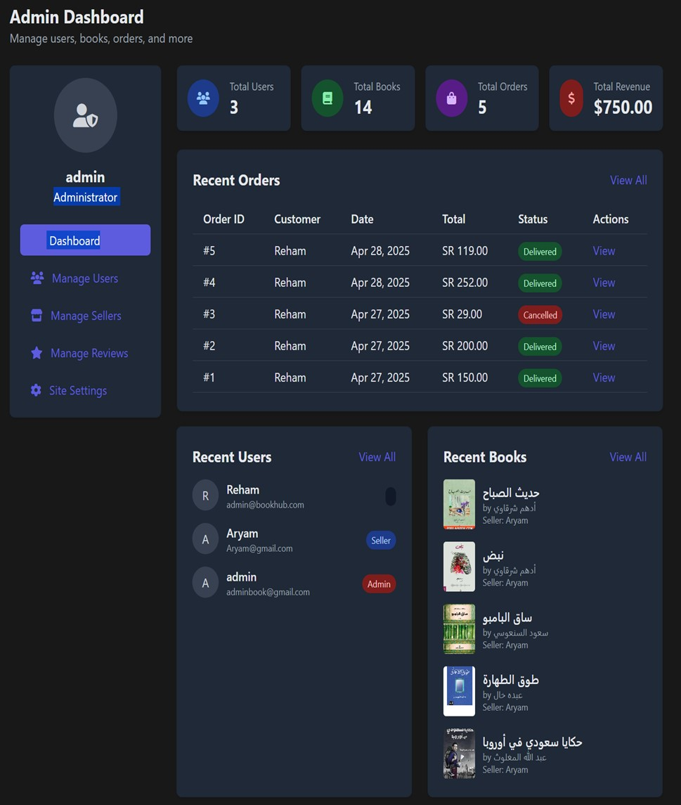
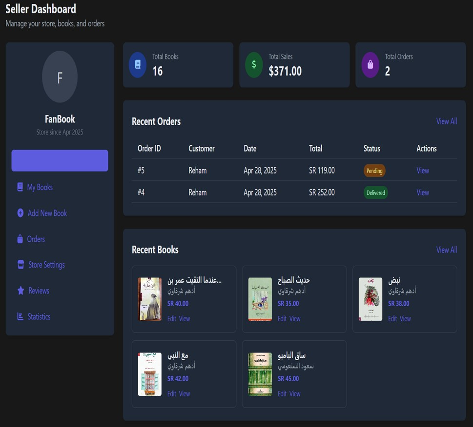
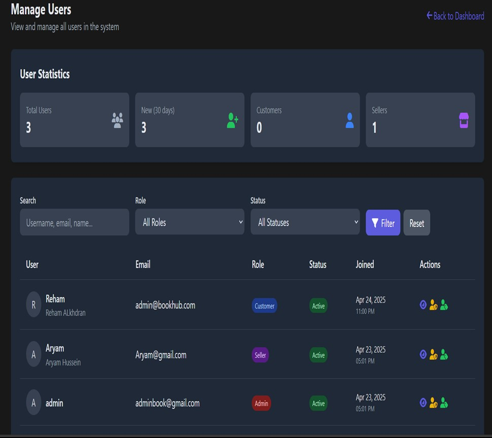
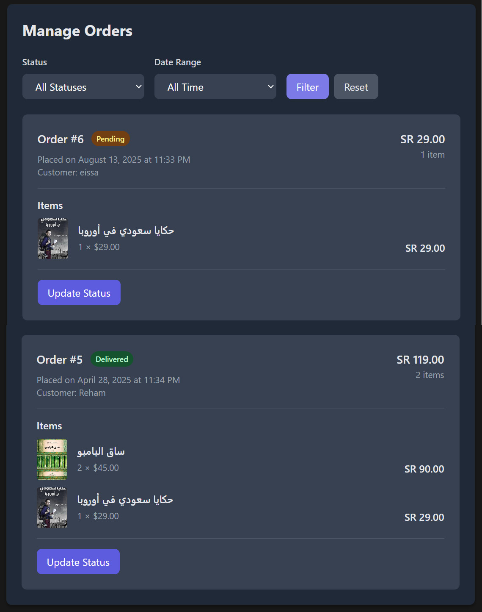

# BookHaven - Online Bookstore Platform

<div align="center">
  
  
  [[PHP](https://img.shields.io/badge/PHP-777BB4?style=for-the-badge&logo=php&logoColor=white)](https://php.net)
  [[MySQL](https://img.shields.io/badge/MySQL-005C84?style=for-the-badge&logo=mysql&logoColor=white)](https://mysql.com)
  [[HTML5](https://img.shields.io/badge/HTML5-E34F26?style=for-the-badge&logo=html5&logoColor=white)](https://html.spec.whatwg.org)
  [[CSS3](https://img.shields.io/badge/CSS3-1572B6?style=for-the-badge&logo=css3&logoColor=white)](https://www.w3.org/Style/CSS)
  [[JavaScript](https://img.shields.io/badge/JavaScript-F7DF1E?style=for-the-badge&logo=javascript&logoColor=black)](https://javascript.com)
</div>

## 📖 About The Project

BookHaven is a comprehensive online bookstore platform designed to connect book sellers with readers through an intuitive and responsive web interface. The system facilitates a marketplace where multiple sellers can list their books for sale while customers can browse, search, and purchase from a diverse catalog.

The platform allows customers to browse all available books and place orders, while giving sellers the ability to accept or reject these orders based on their inventory and business requirements.

### 🌟 Key Features

- **Multi-Vendor Marketplace**: Support for multiple book sellers
- **User Authentication**: Secure login system with role-based access (Customer, Seller, Admin)
- **Book Management**: Comprehensive book catalog with detailed information
- **Order Management**: Complete order processing workflow
- **Review System**: Customer reviews and ratings
- **Shopping Cart**: Add to cart and wishlist functionality
- **Search & Filter**: Advanced book search and filtering options
- **Admin Dashboard**: Powerful admin tools for platform management
- **Seller Dashboard**: Dedicated seller interface for inventory management
- **Responsive Design**: Mobile-friendly interface
- **Dark Mode Support**: Toggle between light and dark themes

### 👤 For Customers
- 🔍 **Advanced Search & Filtering** - Find books by title, author, genre, price range
- 🛒 **Shopping Cart** - Add, remove, and modify book quantities
- 💳 **Secure Checkout** - Multiple payment options with encrypted transactions
- 📱 **Responsive Design** - Seamless experience across all devices
- ⭐ **Reviews & Ratings** - Read and write book reviews
- 📧 **Order Tracking** - Real-time order status updates
- 👤 **User Profile** - Manage personal information and order history

### 🏪 For Sellers
- 📚 **Inventory Management** - Add, edit, and manage book listings
- 📊 **Sales Analytics** - Detailed sales reports and insights
- 📦 **Order Processing** - Manage incoming orders and shipping
- 💰 **Revenue Tracking** - Monitor earnings and transaction history

### 🔧 For Administrators
- 👥 **User Management** - Manage customer and seller accounts
- ✅ **Seller Verification** - Approve new seller applications
- 📋 **Content Moderation** - Review and moderate book listings
- 🛠️ **System Maintenance** - Platform configuration and monitoring

## 🛠️ Built With

### Backend
- **PHP 7.4+** - Server-side scripting
- **MySQL 5.7+** - Database management
- **Apache/Nginx** - Web server

### Frontend
- **HTML5** - Markup language
- **CSS3 & Bootstrap 5** - Styling and responsive design
- **JavaScript (ES6+)** - Client-side functionality
- **jQuery** - DOM manipulation and AJAX

### Security & Tools
- **bcrypt** - Password hashing
- **CSRF Protection** - Cross-site request forgery prevention
- **Input Validation** - Data sanitization and validation
- **Git** - Version control

## 🚀 Getting Started

### Prerequisites

Before you begin, ensure you have the following installed:

```bash
# Check PHP version (7.4 or higher required)
php --version

# Check MySQL version (5.7 or higher required)
mysql --version

# Check if Composer is installed (for dependency management)
composer --version
```

### Installation

1. **Clone the repository**
   ```bash
   git clone https://github.com/yourusername/bookhaven.git
   cd bookhaven
   ```

2. **Set up the database**
   ```bash
   # Create a new MySQL database
   mysql -u root -p
   CREATE DATABASE bookhaven;
   exit
   
   # Import the database schema
   mysql -u root -p bookhaven < database/bookhaven.sql
   ```

3. **Configure database connection**
   ```bash
   # Copy the example configuration file
   cp config/database.example.php config/database.php
   
   # Edit the database configuration
   nano config/database.php
   ```

4. **Set up web server**
   ```bash
   # For Apache (place in htdocs or www folder)
   # For development, you can use PHP's built-in server:
   php -S localhost:8000
   ```

5. **Configure permissions**
   ```bash
   # Set proper permissions for upload directories
   chmod 755 assets/images/
   chmod 644 assets/images/*
   ```

### Configuration

Edit `config/database.php` with your database credentials:

```php
<?php
define('DB_HOST', 'localhost');
define('DB_USER', 'your_username');
define('DB_PASS', 'your_password');
define('DB_NAME', 'bookhaven');
define('DB_CHARSET', 'utf8mb4');
?>
```
## 🖼️ Screenshots

### Home Page


### Book Catalog


### Book Details


### Shopping Cart


### Admin Dashboard


### Seller Dashboard


### User Management


### Order Management


## 🛠️ Built With

* **Backend**: PHP 7.4+
* **Database**: MySQL 5.7+
* **Frontend**: HTML5, CSS3, JavaScript
* **Styling**: Custom CSS (Responsive Design)
* **Icons**: Font Awesome
* **Charts**: Chart.js
* **Server**: Apache (XAMPP/WAMP recommended)

## 📋 Prerequisites

Before you begin, ensure you have met the following requirements:

- PHP 7.4 or higher
- MySQL 5.7 or higher
- Apache Web Server
- Modern web browser

## ⚡ Installation

1. **Clone the repository**
   ```bash
   git clone https://github.com/yourusername/bookhaven.git
   cd bookhaven
   ```

2. **Set up your web server**
   - Place the project folder in your web server's document root
   - For XAMPP: `C:\xampp\htdocs\bookhaven`
   - For WAMP: `C:\wamp64\www\bookhaven`

3. **Create the database**
   ```sql
   CREATE DATABASE bookhaven;
   ```

4. **Import the database structure**
   ```bash
   mysql -u root -p bookhaven < database/bookhaven.sql
   ```

5. **Configure database connection**
   - Open `config/database.php`
   - Update the database credentials:
   ```php
   $servername = "localhost";
   $username = "root";
   $password = "";
   $dbname = "bookhaven";
   ```

6. **Set up file permissions**
   - Ensure the `upload/` directory is writable
   ```bash
   chmod 755 upload/
   ```

7. **Access the application**
   - Open your web browser
   - Navigate to `http://localhost/bookhaven`

## 🚀 Usage

### For Customers
1. Register as a new customer or login with existing credentials
2. Browse the book catalog
3. Search and filter books by category, author, or title
4. Add books to cart or wishlist
5. Place orders and track order status
6. Write reviews for purchased books

### For Sellers
1. Register as a seller and set up your store
2. Add books to your inventory
3. Manage book details, pricing, and stock
4. Process customer orders (accept/reject)
5. View sales analytics and reports
6. Manage store settings

### For Administrators
1. Login with admin credentials
2. Manage users, books, and categories
3. Monitor platform activity
4. Review and approve seller applications
5. Generate reports and analytics
6. Configure site settings

## 🏗️ Project Structure

```
bookhaven/
├── 📄 index.php
├── 📄 book-details.php
├── 📄 books.php
├── 📄 categories.php
├── 📄 cart.php
├── 📄 checkout.php
└── 📄 README.md
│
├───assets
│   ├───css
│   │       style.css
│   │       tailwindcss.css
│   │
│   ├───images
│   └───js
│           main.js
│           script.js
│
├───config
│       config.php
│       database.php
│
├───controllers
│       AdminController.php
│       AuthController.php
│       BookController.php
│       CartController.php
│       OrderController.php
│       ReviewController.php
│       sellerController.php
│       WishlistController.php
│
├───models
│       Book.php
│       Cart.php
│       Category.php
│       Order.php
│       Review.php
│       Seller.php
│       User.php
│       Wishlist.php
│
├───Screenshots
│       2025-08-13_233904.jpg
│       Add-Book.jpg
│       admin-dashboard.jpg
│       book-catalog.jpg
│       book-details.jpg
│       Book-Management.jpg
│       BookReviews.jpg
│       catalog.png
│       home-page.jpg
│       Order-History.jpg
│       order-management.jpg
│       Seller-Books.jpg
│       seller-dashboard.jpg
│       SellerAnalytics.jpg
│       SellerBooks.png
│       SellerOrders.jpg
│       SellerStoreSettings.jpg
│       shopping-cart.jpg
│       ShoppingCart.png
│       SiteSettings.jpg
│       user-management.jpg
│
├───uploads
│   ├───books
│   │       67fc3ebb289e2.jpg
│   │       67fd632e9ef46.png
│   │
│   └───book_covers
├───utils
│       helpers.php
│       validation.php
│
└───views
    ├───admin
    │   │   books.php
    │   │   dashboard.php
    │   │   logs.php
    │   │   orders.php
    │   │   pending-approvals.php
    │   │   reports.php
    │   │   sellers.php
    │   │   settings.php
    │   │   users.php
    │   │
    │   └───includes
    │           admin-footer.php
    │           admin-header.php
    │           admin-sidebar.php
    │
    ├───auth
    │       login.php
    │       logout.php
    │       register.php
    │
    ├───customer
    │       orders.php
    │       profile.php
    │       review.php
    │       wishlist.php
    │
    ├───includes
    │       footer.php
    │       functions.php
    │       header.php
    │       helpers.php
    │       navigation.php
    │
    └───seller
        │   add-book.php
        │   book-details.php
        │   books.php
        │   contact.php
        │   dashboard.php
        │   edit-book.php
        │   inventory.php
        │   logout.php
        │   order-details.php
        │   orders.php
        │   pending.php
        │   pending.php
        │   profile.php
        │   sales.php
        │   settings.php
        │
        └───includes
                seller-footer.php
                seller-header.php
                seller-sidebar.php
        │   settings.php
        │
        └───includes
                seller-footer.php
                seller-header.php
                seller-sidebar.php
        │
        └───includes
                seller-footer.php
                seller-header.php
                seller-sidebar.php
                seller-header.php
                seller-sidebar.php
                seller-sidebar.php


```

## 👥 User Roles

### 🛍️ Customer
- Browse and search books
- Add to cart and wishlist
- Place and track orders
- Write reviews and ratings
- Manage profile

### 🏪 Seller
- Manage book inventory
- Process orders
- View sales analytics
- Manage store settings
- Handle customer inquiries

### 👨‍💼 Administrator
- Platform oversight
- User management
- Content moderation
- Site configuration
- Analytics and reporting

## 🔧 Configuration

## 🗄️ Database Schema
### Core Tables

```sql
-- Users table (base for all user types)
CREATE TABLE users (
    userID INT PRIMARY KEY AUTO_INCREMENT,
    name VARCHAR(255) NOT NULL,
    email VARCHAR(255) UNIQUE NOT NULL,
    password VARCHAR(255) NOT NULL,
    user_type ENUM('customer', 'seller', 'admin') DEFAULT 'customer',
    created_at TIMESTAMP DEFAULT CURRENT_TIMESTAMP
);

-- Books table
CREATE TABLE books (
    bookID INT PRIMARY KEY AUTO_INCREMENT,
    title VARCHAR(255) NOT NULL,
    author VARCHAR(255) NOT NULL,
    price DECIMAL(10,2) NOT NULL,
    stock INT DEFAULT 0,
    category VARCHAR(100),
    rating DECIMAL(3,2) DEFAULT 0,
    sellerID INT,
    FOREIGN KEY (sellerID) REFERENCES users(userID)
);

-- Orders table
CREATE TABLE orders (
    orderID INT PRIMARY KEY AUTO_INCREMENT,
    customerID INT NOT NULL,
    orderDate TIMESTAMP DEFAULT CURRENT_TIMESTAMP,
    totalAmount DECIMAL(10,2) NOT NULL,
    status ENUM('pending', 'processing', 'shipped', 'delivered') DEFAULT 'pending',
    FOREIGN KEY (customerID) REFERENCES users(userID)
);
```

[View complete database schema](database/bookhaven.sql)

## 🔗 API Endpoints

### Authentication
```
POST   /controllers/AuthController.php?action=login
POST   /controllers/AuthController.php?action=register
POST   /controllers/AuthController.php?action=logout
```

### Books
```
GET    /controllers/BookController.php?action=getAll
GET    /controllers/BookController.php?action=getById&id={id}
POST   /controllers/BookController.php?action=create
PUT    /controllers/BookController.php?action=update&id={id}
DELETE /controllers/BookController.php?action=delete&id={id}
```

### Cart
```
GET    /controllers/CartController.php?action=getItems
POST   /controllers/CartController.php?action=addItem
PUT    /controllers/CartController.php?action=updateItem
DELETE /controllers/CartController.php?action=removeItem
```

### Orders
```
GET    /controllers/OrderController.php?action=getByUser
POST   /controllers/OrderController.php?action=create
PUT    /controllers/OrderController.php?action=updateStatus
```

## 📱 Usage Examples

### Adding a Book to Cart
```javascript
// Add book to cart via AJAX
function addToCart(bookId, quantity) {
    $.ajax({
        url: 'controllers/CartController.php',
        method: 'POST',
        data: {
            action: 'addItem',
            bookId: bookId,
            quantity: quantity
        },
        success: function(response) {
            updateCartCounter();
            showNotification('Book added to cart!');
        }
    });
}
```

### User Registration
```php
// Register new user
if ($_POST['action'] == 'register') {
    $user = new Customer();
    $user->name = $_POST['name'];
    $user->email = $_POST['email'];
    $user->password = password_hash($_POST['password'], PASSWORD_BCRYPT);
    
    if ($user->register()) {
        header('Location: views/auth/login.php');
    }
}
```

## 🤝 Contributing

We welcome contributions to BookHaven! Here's how you can help:

### Development Workflow

1. **Fork the repository**
2. **Create a feature branch**
   ```bash
   git checkout -b feature/AmazingFeature
   ```
3. **Make your changes**
4. **Test your changes**
   ```bash
   # Run tests (if available)
   php tests/run_tests.php
   ```
5. **Commit your changes**
   ```bash
   git commit -m 'Add some AmazingFeature'
   ```
6. **Push to the branch**
   ```bash
   git push origin feature/AmazingFeature
   ```
7. **Open a Pull Request**

### Coding Standards

- Follow PSR-4 autoloading standards
- Use meaningful variable and function names
- Comment complex logic
- Maintain consistent indentation (4 spaces)
- Validate all user inputs
- Use prepared statements for database queries

### Bug Reports

When reporting bugs, please include:
- PHP version
- MySQL version
- Browser and version
- Steps to reproduce
- Expected vs actual behavior
- Error messages (if any)

## 📋 Roadmap

- [ ] **Phase 1**: Core functionality (✅ Completed)
  - [x] User authentication
  - [x] Book catalog
  - [x] Shopping cart
  - [x] Order processing

- [ ] **Phase 2**: Enhanced features (🚧 In Progress)
  - [ ] Advanced search filters
  - [ ] Wishlist functionality
  - [ ] Book recommendations
  - [ ] Mobile app API

- [ ] **Phase 3**: Advanced features (📋 Planned)
  - [ ] Multi-language support
  - [ ] Payment gateway integration
  - [ ] Real-time notifications
  - [ ] Analytics dashboard

See the [open issues](https://github.com/yourusername/bookhaven/issues) for a full list of proposed features and known issues.

## 🧪 Testing

### Manual Testing
```bash
# Test the application manually
1. Register a new user
2. Browse books
3. Add books to cart
4. Complete checkout process
5. Test admin functions
```

### Automated Testing (Planned)
```bash
# Run unit tests
php vendor/bin/phpunit tests/

# Run integration tests
php tests/integration/run_tests.php
```

## 📈 Performance

### Optimization Features
- **Database indexing** on frequently queried columns
- **Image optimization** for book covers
- **Caching** for book listings
- **Minified CSS/JS** for faster loading
- **CDN support** for static assets

### Performance Metrics
- Average page load time: < 2 seconds
- Database query optimization: < 100ms per query
- Mobile PageSpeed Score: > 90
- Desktop PageSpeed Score: > 95

## 🔒 Security

### Security Measures Implemented
- **Password hashing** using bcrypt
- **SQL injection prevention** with prepared statements
- **XSS protection** with input sanitization
- **CSRF tokens** for form submissions
- **Session management** with secure cookies
- **Input validation** for all user data

### Security Best Practices
```php
// Example: Secure password hashing
$hashedPassword = password_hash($password, PASSWORD_BCRYPT);

// Example: Prepared statement
$stmt = $pdo->prepare("SELECT * FROM users WHERE email = ?");
$stmt->execute([$email]);
```


## 📞 Contact

**Project Maintainer**: ALgumaei Eissa
- Email: algomaieissa@gmail.com
- LinkedIn: [issa-algomaie](https://www.linkedin.com/in/issa-algomaie)
- GitHub: [@Algomaie](https://github.com/Algomaie)

**Project Link**: [https://github.com/Algomaie/BookHaven](https://github.com/Algomaie/BookHaven)

## 🙏 Acknowledgments

### Libraries and Frameworks
- [Bootstrap](https://getbootstrap.com/) - CSS framework
- [jQuery](https://jquery.com/) - JavaScript library
- [Font Awesome](https://fontawesome.com/) - Icons

### Inspiration and Resources
- [MDN Web Docs](https://developer.mozilla.org/) - Web development documentation
- [PHP.net](https://php.net/) - PHP documentation
- [Stack Overflow](https://stackoverflow.com/) - Community support

### Special Thanks
- Open source community for continuous inspiration
- Beta testers who provided valuable feedback
- Contributors who helped improve the codebase


## 📊 Project Status

- ✅ User Authentication System
- ✅ Book Catalog Management
- ✅ Shopping Cart Functionality
- ✅ Order Management System
- ✅ Review and Rating System
- ✅ Admin Dashboard
- ✅ Seller Dashboard
- ✅ Responsive Design
- ✅ Dark Mode Support
- 🔄 Payment Gateway Integration (In Progress)
- 📋 Mobile App (Planned)

---

<div align="center">

**⭐ Star this repository if you found it helpful!**

Made with ❤️ by [Algomaie](https://github.com/Algomaie)

[🔝 Back to top](#bookhaven---online-bookstore-)

<div align="center">
  <strong>Made with ❤️ Algomaie</strong>
</div>

---
